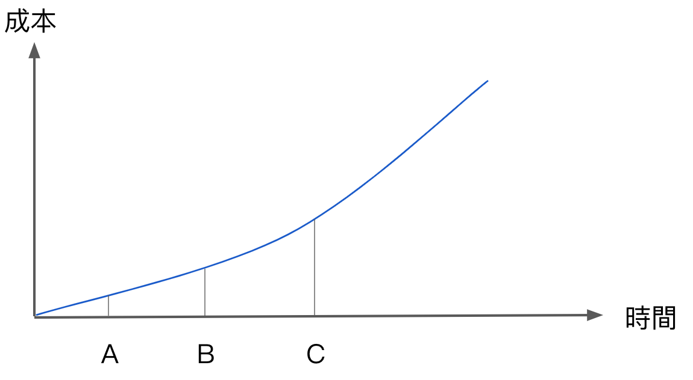

> 如果你認為好架構的代價是昂貴的，那不妨試試糟糕的架構。

可以翻閱POSA1-5，看看有哪些架構。
Clean Architecture 某種程度回應了敏捷開發方法說長出架構這件事情，好架構很貴不過可以先套不太貴的 Clean Architecture 。

# 與RUP/UP的關係 #
UP方法論核心觀念是 __Architecture Central__，要在專案起始的幾的週期消化大約 20% 的use case 目的是完成 Architecture Baseline，而在比較 Agile 化[1]的開發方法論中並不鼓勵特別花一段時間進行架構設計，而是隨著專案的進行同時開發功能又同時演化架構，但這又要大師級的人才做得到，那該怎麼在比較 Agile化的方法論中進行架構設計呢？

# 直接使用Clean Architecture #
Clean Architecture 就是 Agile 時代的 Architecture Baseline，開發者以此為基礎再慢慢隨著
需求的消化、理解而進行架構演化，可以更 clean 也可以更 dirty，都是架構的設計決策。

# 軟體架構形狀的目的(軟體架構與功能有沒有關係？) #
## 軟體架構的形狀的目的 ##
The purpose of the shape is to facilitate the __development__, __deployment__, __operation__, and __maintenance__ of the software system contained within it.

架構與開發方法論有關係，例如agile方法論與雲端時代就特別強調 deployment，而 deployment 又與 dependency management 有關，這又非常困難。

The strategy behind that facilitation is to leave as many options open as possible, for as long as possible.

軟體架構要讓各種選項的選用盡可能保持開放，而且允許許多細節延遲決策，讓細節可抽換。

### 軟體架構基本上與功能（行為）無關 ###
主導軟體架構的 force 是 nonfunctional requirement，functional requirement 並非主要 force。

### 好的架構與功能無關，但好的架構要能夠讓使用者看得出系統的功能。 ###
package、class 用功能分類與命名，不是用「材質」命名。例如：AddStudentUseCase 就比 StudentService 好。

### The ultimate goal of software architecture is to minimize the lifetime cost of the system and to maximize programmer productivity. ###
非常clean 的架構做起來很煩，短期成本又很高且 lifetime cost 無法量化。
Clean code 並非永遠都是高標準，架構決策者要取捨。

# 如何評量設計品質 #
## 衡量滿足客戶需求的工作量 ##
如果工作量很低，而且整個軟體生命週期都保持很低，則該設計就是好設計。
從開發者的角度來看，他們從利害關係人收到不完整的描述，每個需求都比上一個更難達到，產品不再能隨著利害關係人的想法輕易地改變，最終軟體變成了硬體。
### 讓軟體變軟 ###
一個好的架構，修改的成本應該只和修改的工作量(Scope)有關，和時間點無關。
開發人員的主要職責之一就是協助業務經理判斷產品架構的重要性高於功能的急迫性。

#### 現況 ####

在大多數的經驗中，隨著專案的進行，「修改的成本」往往越來越高，遺留系統的修改成本又比開發中系統高。

[1]這裡用的是Agile化，不是Agile，因為我認為所有的方法論理論上都是Agile方法，差別在不同方法對
於「變化」的反應速度不同，如果前期為了架構設計花了許多時間消化需求後又發生需求變化，那時間可能就
白費了。但話又說回來，對需求變化的反應速度真的越快越好嗎？
